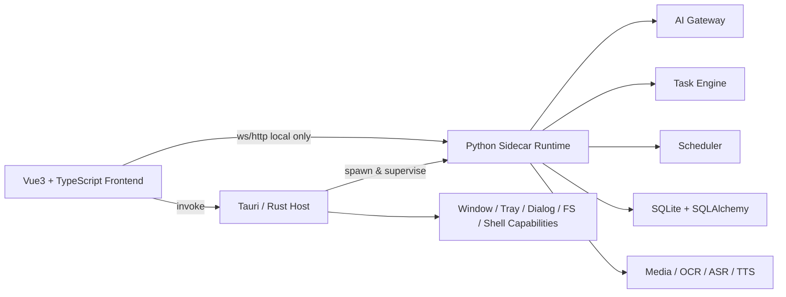

# TK-OPS 架构方案建议（Markdown版）

## 1. 文档目的

本文用于给 TK-OPS 项目确定一套可落地的技术架构方案。

目标前提：

- 最终交付为 **Windows 本地 exe**
- **不依赖线上服务器和域名** 才能运行核心功能
- 界面要求 **美观**，并支持 **复杂交互页面**
- 项目需要 **深度接入 AI**
- 需要兼顾后期扩展、维护和团队协作成本

本方案基于当前 PRD 的核心要求进行调整和重构，而不是机械沿用原始技术描述。

---

## 2. 最终结论

### 推荐采用

**Tauri（桌面壳） + Vue 3 / TypeScript（UI 与交互） + Python Sidecar Runtime（AI 与业务底座） + SQLite（本地存储）**

### 不建议采用

- 全量纯 PySide6 Widgets
- 全量纯 HTML + JS + Python
- 把 Python 设计成“类线上后端服务中心”的架构
- 把所有前端调用都做成 localhost REST API

### 一句话判断

这不是一个普通后台系统，而是一个：

**本地桌面应用 + AI 工作台 + 多页面复杂交互系统**。

因此最佳方案不是“谁最传统”，而是：

**谁最适合本地交付、复杂交互、AI 深度集成、长期维护。**

---

## 3. 为什么推荐这套方案

### 3.1 适合本地 exe 交付

Tauri 本身就是桌面应用宿主，前端资源可随程序一起打包，适合做纯本地应用交付。

这意味着：

- 不需要购买域名
- 不需要部署线上服务
- 不需要依赖用户外网访问主站才能打开程序
- 可以直接走 Windows 安装包 / exe 分发路径

### 3.2 适合“界面好看 + 复杂交互”

Vue 3 + TypeScript 比传统原生桌面控件更适合做以下页面：

- 节点编排
- 画布编辑
- 时间轴
- 动态图表
- 拖拽布局
- 多面板属性编辑
- 富交互工作台

对 TK-OPS 来说，以下页面尤其适合用 Web 技术做：

- AI内容工厂
- 视觉编辑器
- 可视化实验室
- Dashboard
- 创意工坊

### 3.3 适合“AI 深度接入”

Python 继续承担核心能力层，可以最大限度利用已有生态：

- LLM 接入
- LiteLLM
- 多 Provider 路由
- OCR / ASR / TTS
- 数据处理
- 视频处理
- 调度与后台任务
- 本地数据库管理

这比把 AI 核心迁移到 JS/TS 侧要稳得多。

### 3.4 更贴近当前 PRD 的真实需求

你当前 PRD 虽然写了 PySide6、MVVM、plugin shell、LiteLLM、ProviderAdapter、任务调度、CanvasPage 等内容，但真正表达出来的系统特征是：

- 页面很多
- 角色很多
- AI 深度接入
- 后台任务很多
- 未来会持续扩展
- 存在明显的画布型页面

这说明它不是“小工具”，而是一个需要明确边界的大型本地应用。

---

## 4. 目标架构总览



---

## 5. 各层职责划分

## 5.1 Tauri / Rust：桌面宿主层

负责：

- 应用启动
- 窗口生命周期
- 托盘
- 原生菜单
- 文件选择器
- 目录选择器
- 本地能力权限边界
- Python sidecar 启动、守护、重启
- 安装包配置
- 更新与发布能力预留

原则：

- Rust 只做“系统桥”和“安全边界”
- 不承载大部分业务逻辑
- 不承载 AI 主逻辑

---

## 5.2 Vue 3 + TypeScript：UI 表现层

负责：

- 所有页面 UI
- 页面路由
- 交互动画
- 图表
- 节点画布
- 时间轴
- 表单
- 多面板布局
- 状态展示
- 任务结果渲染
- AI 流式输出展示

原则：

- UI 层只处理表现逻辑
- 不直接承载核心业务规则
- 不直接管理数据库
- 不直接管理模型调用链路

---

## 5.3 Python Sidecar Runtime：业务与 AI 核心层

负责：

- AI Gateway
- LiteLLM 集成
- ProviderAdapter
- 模型管理
- 角色预设
- Prompt 管理
- 流式输出
- 回退链路
- 任务系统
- 调度系统
- 数据访问
- 媒体处理
- OCR / ASR / TTS
- 日志与审计
- 本地配置读写

原则：

- Python 是“本地运行时”
- 不是为了模拟线上 BFF 或微服务
- 所有重逻辑和长任务都放这里

---

## 6. 关键设计原则

## 6.1 不是 Local Server First，而是 Local Runtime First

不要把 Python 理解成“本地版后端网站”。

正确理解应该是：

- Python 是本地能力引擎
- 前端是桌面应用界面
- Tauri 是本地宿主与安全边界

也就是说，**是桌面应用调用本地能力引擎**，不是浏览器网页访问一套 localhost 网站。

---

## 6.2 通信按“短调用”和“长调用”分流

### 前端 -> Tauri Command
适合：

- 获取版本
- 打开文件选择器
- 选择目录
- 读取本地路径
- 控制窗口
- 启动 / 重启 sidecar

### 前端 -> Python WebSocket
适合：

- AI 流式输出
- 任务进度
- 日志事件
- 批量任务状态
- 取消 / 暂停 / 恢复
- 工作流运行状态

### 前端 -> Python HTTP
只保留少量接口：

- 健康检查
- 初始化握手
- 配置读取
- 简单查询

**不建议所有业务都走 REST API。**

---

## 6.3 前端不直连高危系统能力

高危能力必须走 Tauri / Rust：

- 文件系统敏感路径访问
- 系统 Shell
- 原生对话框
- sidecar 管理
- 权限能力判断
- Credential Manager 等安全能力

前端不要绕过 Tauri 直接掌控这些能力。

---

## 7. 推荐目录结构

```text
tk-ops/
├─ apps/
│  ├─ desktop/
│  │  ├─ src/
│  │  │  ├─ app/
│  │  │  │  ├─ router/
│  │  │  │  ├─ store/
│  │  │  │  ├─ layout/
│  │  │  │  ├─ boot/
│  │  │  │  └─ providers/
│  │  │  ├─ pages/
│  │  │  │  ├─ dashboard/
│  │  │  │  ├─ account/
│  │  │  │  ├─ analytics/
│  │  │  │  ├─ automation/
│  │  │  │  ├─ ai/
│  │  │  │  ├─ crm/
│  │  │  │  └─ system/
│  │  │  ├─ components/
│  │  │  │  ├─ shell/
│  │  │  │  ├─ forms/
│  │  │  │  ├─ table/
│  │  │  │  ├─ charts/
│  │  │  │  ├─ canvas/
│  │  │  │  └─ detail-panel/
│  │  │  ├─ modules/
│  │  │  │  ├─ ai-client/
│  │  │  │  ├─ task-client/
│  │  │  │  ├─ config-client/
│  │  │  │  └─ ipc/
│  │  │  ├─ styles/
│  │  │  └─ types/
│  │  └─ src-tauri/
│  │     ├─ src/
│  │     │  ├─ commands/
│  │     │  ├─ state/
│  │     │  ├─ process/
│  │     │  ├─ security/
│  │     │  └─ main.rs
│  │     ├─ capabilities/
│  │     ├─ icons/
│  │     └─ tauri.conf.json
│  │
│  └─ py-runtime/
│     ├─ src/
│     │  ├─ main.py
│     │  ├─ api/
│     │  │  ├─ ws/
│     │  │  ├─ http/
│     │  │  └─ schemas/
│     │  ├─ application/
│     │  │  ├─ services/
│     │  │  ├─ usecases/
│     │  │  └─ dto/
│     │  ├─ domain/
│     │  │  ├─ entities/
│     │  │  ├─ value_objects/
│     │  │  ├─ repositories/
│     │  │  └─ policies/
│     │  ├─ infrastructure/
│     │  │  ├─ db/
│     │  │  ├─ llm/
│     │  │  ├─ tasking/
│     │  │  ├─ scheduler/
│     │  │  ├─ media/
│     │  │  ├─ storage/
│     │  │  ├─ secrets/
│     │  │  └─ logging/
│     │  ├─ plugins/
│     │  │  ├─ providers/
│     │  │  ├─ presets/
│     │  │  └─ templates/
│     │  └─ shared/
│     ├─ pyproject.toml
│     ├─ runtime.spec
│     └─ tests/
│
├─ packages/
│  ├─ ui-kit/
│  ├─ protocol/
│  └─ design-tokens/
│
├─ scripts/
│  ├─ build-runtime.ps1
│  ├─ build-desktop.ps1
│  └─ release.ps1
│
└─ docs/
   ├─ architecture/
   ├─ api-contracts/
   └─ deployment/
```

---

## 8. 前端页面技术分配建议

## 8.1 标准页
适合用普通页面模板：

- Dashboard
- 账号管理
- AI供应商配置
- 任务队列
- 任务调度
- CRM客户关系管理
- 自动回复控制台
- 定时发布
- 下载器
- 网络诊断

## 8.2 工作台页
适合多面板布局：

- 素材工厂
- 蓝海分析
- 竞争对手监控
- 利润分析系统
- 数据报告生成器
- 互动分析

## 8.3 画布页
适合单独交互内核：

- 视觉编辑器
- AI内容工厂
- 可视化实验室

---

## 9. 前端工程组织建议

每个页面保持统一四层：

```text
page.vue               # 页面容器
usePageViewModel.ts    # 页面逻辑
page.store.ts          # 页面状态
page.client.ts         # 与 Python/Tauri 通信
```

### 示例

```text
pages/ai-copywriter/
├─ AiCopywriterPage.vue
├─ useAiCopywriterViewModel.ts
├─ aiCopywriter.store.ts
└─ aiCopywriter.client.ts
```

这样可以保留原 PRD 里“ViewModel 管状态和命令”的思想，只是实现方式从 Qt ViewModel 转成 Vue composable + store。

---

## 10. Python Runtime 内部模块设计

## 10.1 AI Gateway

职责：

- LiteLLM 统一入口
- 多供应商接入
- 默认模型映射
- 页面级模型策略
- 角色级模型策略
- 流式输出
- fallback 链
- 成本统计
- 错误归一化

---

## 10.2 Task Engine

职责：

- 任务声明
- 任务入队
- worker 池
- 执行状态
- 重试
- 取消 / 暂停 / 恢复
- 结果回传
- 落库

---

## 10.3 Scheduler

职责：

- cron 表达式
- 时间窗控制
- DAG 依赖
- 冲突检测
- 立即运行
- 调度日志

---

## 10.4 Media Pipeline

职责：

- 视频导入
- 帧提取
- ASR
- OCR
- 字幕草稿
- 封面抽帧
- 音频处理
- TTS

---

## 10.5 Repository Layer

职责：

- SQLAlchemy 封装
- SQLite 访问
- 事务边界
- 核心实体仓储
- 文件元数据分离存储

---

## 11. 通信协议建议

## 11.1 WebSocket 消息格式

### 前端发起任务

```json
{
  "type": "task.start",
  "requestId": "req_123",
  "payload": {
    "taskType": "ai.copy.generate",
    "page": "ai_copywriter",
    "params": {
      "prompt": "...",
      "model": "gpt-4.1-mini"
    }
  }
}
```

### Python 推送任务进度

```json
{
  "type": "task.progress",
  "requestId": "req_123",
  "taskId": "task_001",
  "payload": {
    "status": "running",
    "percent": 42,
    "message": "Generating variants..."
  }
}
```

### Python 推送流式 AI 输出

```json
{
  "type": "ai.stream.delta",
  "requestId": "req_123",
  "payload": {
    "text": "新增输出片段"
  }
}
```

### Python 推送任务完成

```json
{
  "type": "task.completed",
  "requestId": "req_123",
  "taskId": "task_001",
  "payload": {
    "result": {}
  }
}
```

---

## 12. 安全设计建议

## 12.1 本地服务限制

Python runtime 必须：

- 只监听 `127.0.0.1`
- 使用随机端口或启动时协商端口
- 通过 session token 鉴权
- 拒绝无 token 的连接

---

## 12.2 权限分层

### Rust/Tauri 层
负责高危权限：

- 文件系统敏感访问
- sidecar 启停
- 原生 shell 能力
- 系统级窗口与菜单能力

### Python 层
负责业务能力：

- AI
- 任务
- 调度
- 数据
- 媒体处理

### Vue 层
只消费能力，不直接拥有高危权限。

---

## 12.3 密钥管理

建议：

- 优先使用 Windows Credential Manager
- Python 只通过引用获取密钥
- UI 永不回显明文 Key
- 所有敏感操作纳入审计日志

---

## 13. 打包与发布建议

## 13.1 Tauri 主应用

负责：

- 打包前端资源
- 打包桌面宿主
- 集成 sidecar
- 生成 Windows 安装包

---

## 13.2 Python Runtime

建议使用：

- PyInstaller 打包为 sidecar
- 首期优先 **one-folder**
- 不建议首期使用 **one-file**

原因：

- one-folder 更稳定
- sidecar 调试更方便
- 依赖问题更容易排查
- 出问题时回溯更清晰

---

## 14. 首期 MVP 建议

## 14.1 P0 页面

建议首批只做：

- Setup Wizard
- Dashboard
- 账号管理
- AI供应商配置
- 任务队列
- 任务调度
- AI文案生成
- 定时发布

---

## 14.2 P0 底座能力

必须先打稳：

- Tauri 宿主层
- Python runtime 启动与守护
- WS 通信协议
- AI Gateway
- Task Engine
- Scheduler
- SQLite 初始化
- 日志系统
- 配置系统
- 认证握手

---

## 15. 当前方案相比其他方案的优劣

## 15.1 对比纯 PySide6 Widgets

### 优势
- UI 上限更高
- 更适合复杂交互
- 更容易做现代化产品质感

### 劣势
- 工程栈更重
- 前后端边界要设计清楚

---

## 15.2 对比 Electron + Vue + Python

### 优势
- 通常资源占用更轻
- 原生壳更现代
- 安全边界更明确

### 劣势
- 需要理解 Tauri 能力模型
- Rust 层需要一定学习成本

---

## 15.3 对比纯 HTML + JS + Python

### 优势
- 不依赖线上部署
- 更接近真正桌面应用
- 本地文件和系统集成能力更强

### 劣势
- 初期搭建门槛略高于纯网页项目

---

## 16. 项目落地时最需要避免的坑

### 坑 1：把 Python 变成“本地微服务平台”
后果：接口爆炸、边界混乱、维护困难。

### 坑 2：前端绕过 Tauri 直接拿系统权限
后果：安全性差，后期不可治理。

### 坑 3：先堆页面，后补 runtime
后果：页面很多，但底座不稳，项目很快失控。

### 坑 4：所有通信都走 REST
后果：流式 AI、任务进度、事件通知会很别扭。

### 坑 5：一开始就追求全量页面
后果：开发周期拉长，底层质量下降。

---

## 17. 最终决策建议

### 建议正式定版为

**Tauri + Vue 3 + TypeScript + Python Sidecar Runtime + SQLite**

### 原则总结

- **Tauri 管壳**
- **Vue 管界面**
- **Python 管能力**
- **短调用走 Tauri command**
- **长任务和流式走 Python WebSocket**
- **首期先稳住底座和 P0 页面**

### 结论

这套架构最适合 TK-OPS 当前阶段：

- 满足本地 exe 交付
- 不依赖线上服务器
- 界面美观空间大
- 复杂交互承载能力强
- AI 深度集成顺手
- 后期扩展空间充足

---

## 18. 后续建议

下一阶段建议继续补三份文档：

1. **项目脚手架清单**
2. **前端 / Tauri / Python 通信协议文档**
3. **P0 页面开发顺序与里程碑拆解**

